# Human-LLM Collaboration Workflow

## Core Cooperation Model

This document defines the fundamental collaboration patterns between humans and LLMs in the context management system.

## Context Restoration Flow (Session Start)

```mermaid
flowchart TD
    A["👤 HUMAN: Starts Session"] --> B{"👤 HUMAN: Copy-Paste Session Command?"}
    B -->|Yes| C["🤖 LLM: Reads Session Command"]
    B -->|No| D["🤖 LLM: Generic Start"]
    
    C --> E["🤖 LLM: Read session-handoff.md"]
    E --> F["🤖 LLM: Read current-iteration.md"]
    F --> G["🤖 LLM: Read static/environment.md"]
    G --> H["🤖 LLM: Check dynamic/failed-solutions/"]
    H --> I["🤖 LLM: Read evolving/assumptions-log.md"]
    
    I --> J["🤖 LLM: Analyze Context Files"]
    J --> K["🤖 LLM: Generate 3-5 Specific Questions"]
    K --> L["🤖 LLM: Ask Context-Based Questions"]
    L --> M["👤 HUMAN: Responds to Questions"]
    M --> N["🤖 LLM: Understands Current State"]
    N --> O["🤖 LLM: Begin Productive Session"]
    
    D --> P["🤖 LLM: Ask Generic Questions"]
    P --> Q["👤 HUMAN: Provides Context Manually"]
    Q --> R["🤖 LLM: Less Efficient Session Start"]
```

## Actor Responsibilities

### Human Responsibilities
- **Session Initiation**: Use copy-paste commands for optimal context restoration
- **Question Response**: Provide clear, specific answers to LLM context questions
- **Session Closure**: Trigger proper session end to preserve context
- **Quality Validation**: Confirm LLM understanding and context accuracy
- **Priority Setting**: Guide LLM on next session priorities and focus areas

### LLM Responsibilities
- **Context Reading**: Read files in priority order with validation
- **Question Generation**: Ask specific, context-based questions (not generic)
- **Understanding Validation**: Confirm correct interpretation of context
- **Knowledge Compilation**: Update all relevant context files during closure
- **Handoff Preparation**: Prepare clear context for next session

## Collaboration Principles

### 1. Context-First Approach
- **Human**: Provides structured context through files, not lengthy explanations
- **LLM**: Reads context systematically before asking questions
- **Benefit**: Efficient session starts with complete understanding

### 2. Question-Driven Clarification
- **Human**: Responds to specific questions rather than providing unsolicited information
- **LLM**: Asks targeted questions based on context analysis
- **Benefit**: Focused communication without information overload

### 3. Validation Checkpoints
- **Human**: Confirms LLM understanding at key decision points
- **LLM**: Validates interpretation before proceeding with work
- **Benefit**: Prevents work based on misunderstood context

### 4. Knowledge Preservation
- **Human**: Ensures proper session closure for context preservation
- **LLM**: Documents all discoveries and updates context files
- **Benefit**: Continuous knowledge building across sessions

## Success Metrics

### Collaboration Effectiveness
- **Session Start Time**: <30 seconds from command to productive work
- **Context Accuracy**: >95% of context correctly understood by LLM
- **Knowledge Preservation**: 100% of discoveries captured in context files
- **Session Continuity**: Seamless handoff between sessions

---

**Purpose:** Define the fundamental collaboration model between humans and LLMs
**Audience:** Both humans and LLMs using the context management system
**Usage:** Reference for proper collaboration patterns and quality validation
