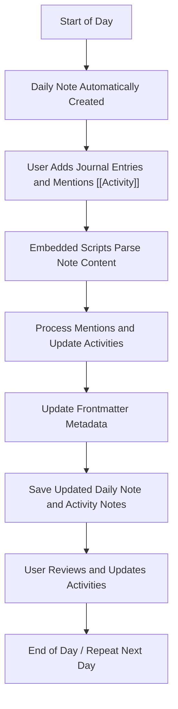

# Daily Usage Workflow for Knowledge Systems Based on Journaling

This guide is intended for system adopters and non-developers to understand the daily workflow of managing knowledge using the journaling system in Obsidian.

## Overview

The system automates the management of daily notes, activities, and knowledge tracking using Obsidian plugins and custom scripts. Users primarily interact by creating daily notes, adding mentions, and updating content. The system handles linking, metadata updates, and activity tracking automatically.

## Daily Workflow Steps

1. **Daily Note Creation**
   - Each day, a new daily note is automatically created in the `Journal` folder by the Obsidian Daily Notes plugin.
   - The daily note uses a predefined template (`DailyNote-template.md`) that includes embedded scripts for processing.

2. **Adding Content and Mentions**
   - Users write journal entries, notes, and tasks in the daily note.
   - To link or create activities, users add mentions using the `[[Activity Name]]` syntax.
   - Mentions automatically link the daily note to corresponding activity notes.

3. **Automatic Processing**
   - When the daily note is saved or opened, embedded scripts run to:
     - Parse the note content and extract metadata.
     - Process mentions and update related activity notes.
     - Generate or update frontmatter metadata such as start dates, status, and responsible persons.
     - Synchronize activities and daily notes dynamically.

4. **Activity Management**
   - Activities referenced in daily notes are tracked and managed in the `Activities` folder.
   - New activities can be created automatically based on mentions.
   - The system maintains up-to-date links and metadata between daily notes and activities.

5. **Review and Follow-up**
   - Users can review activities, update statuses, and add new notes.
   - The system continues to synchronize and update notes based on user input and mentions.

## Flowchart Diagram

## Summary

This workflow allows users to focus on writing and linking notes naturally, while the system automates the organization, linking, and tracking of activities and knowledge. It leverages Obsidian's plugins and custom scripts to provide a seamless journaling and knowledge management experience.

---

*Document created as part of project knowledge base.*
