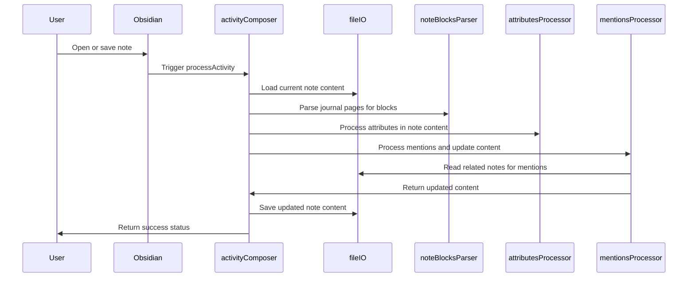
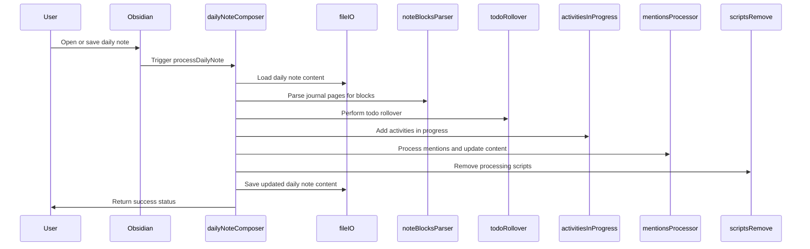
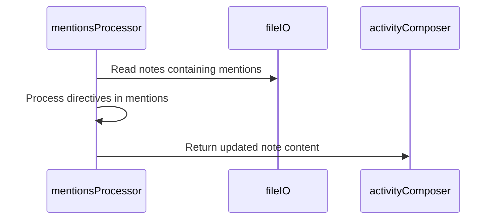

# Developer Manual for Evolving JavaScript Components

This manual is intended for developers who will maintain, extend, and evolve the JavaScript components of the knowledge management system. It provides an internal design overview, interfacing descriptions, data structures, and data flows.

## Overview

The system is built on modular JavaScript components orchestrated within Obsidian's dataview.js and customjs plugin environments. The main goal is to automate note processing, metadata management, and cross-note linking through mentions.

## Key Components and Algorithms

### 1. activityComposer

- **Role:** Central orchestrator for processing activity and daily notes.
- **Responsibilities:**
  - Load and parse note content.
  - Generate and update frontmatter metadata.
  - Coordinate attribute processing and mention handling.
  - Save updated note content.
- **Interfaces:**
  - Uses `fileIO` for file operations.
  - Calls `noteBlocksParser` to parse note content.
  - Calls `attributesProcessor` to process directives.
  - Calls `mentionsProcessor` to handle mentions.
- **Data Flow:**
  - Input: Current note file and content.
  - Output: Updated note content with processed metadata and mentions.
- **Algorithm:**
  1. Load the current note content from the vault.
  2. Extract or initialize frontmatter metadata (startDate, stage, responsible).
  3. Remove existing frontmatter from content to avoid duplication.
  4. Extract embedded dataviewjs blocks.
  5. Parse all journal pages using `noteBlocksParser` to get structured blocks.
  6. Process attributes directives in the content after dataviewjs block using `attributesProcessor`.
  7. Process mentions by scanning parsed blocks and updating content with `mentionsProcessor`.
  8. Regenerate frontmatter with updated metadata.
  9. Combine frontmatter, dataviewjs block, and processed content.
  10. Save the updated note content back to the vault.

### 2. dailyNoteComposer

- **Role:** Specialized orchestrator for daily journal notes.
- **Responsibilities:**
  - Generate daily note frontmatter.
  - Handle todo rollover and activities in progress.
  - Process mentions and remove scripts.
  - Save updated daily note content.
- **Interfaces:** Similar to activityComposer with additional components like `todoRollover` and `activitiesInProgress`.
- **Algorithm:**
  1. Load the daily note content.
  2. Generate frontmatter specific to daily notes.
  3. Parse journal pages for blocks.
  4. Perform todo rollover for incomplete tasks.
  5. Add activities currently in progress.
  6. Process mentions and update content.
  7. Remove processing scripts from dataviewjs blocks.
  8. Save the updated daily note content.

### 3. noteBlocksParser

- **Role:** Parses note content into structured blocks.
- **Block Types:** Headers, callouts, code blocks, mentions, todos, done items.
- **Data Structures:**
  - Returns an array of block objects:
    ```json
    {
      "page": "string",
      "blockType": "string",
      "data": "string",
      "mtime": "number",
      "headerLevel": "number"
    }
    ```
- **Algorithm:**
  1. Split note content into lines.
  2. Iterate through lines, identifying block types based on syntax:
     - Headers start with `#`.
     - Callouts start with `>`.
     - Code blocks start and end with triple backticks.
     - Mentions contain `[[...]]`.
     - Todos start with `- [ ]`.
     - Done items start with `- [x]`.
  3. Group lines into blocks according to type and rules.
  4. Return an array of block objects with metadata.

### 4. mentionsProcessor

- **Role:** Collects and inserts mentions across notes.
- **Responsibilities:**
  - Scan vault for mentions of the current note.
  - Process directives within mentions to update frontmatter.
  - Insert new mention blocks into the current note content.
- **Data Flow:**
  - Input: Current note content, parsed blocks, tagId, frontmatter object.
  - Output: Updated note content with inserted mentions.

### 5. attributesProcessor

- **Role:** Processes directives in note content to update frontmatter metadata.
- **Responsibilities:**
  - Parse and apply operations like assignment, addition, subtraction on attributes.
  - Handle date arithmetic for date fields.
- **Interfaces:** Called by activityComposer and dailyNoteComposer during processing.

### 6. Utilities (fileIO, scriptsRemove, etc.)

- Provide file reading/writing, frontmatter generation, content extraction, and cleanup functions.

## Data Flow Summary

1. User creates or edits a note (daily or activity).
2. The orchestrator (activityComposer or dailyNoteComposer) loads the note content.
3. noteBlocksParser parses the content into blocks.
4. attributesProcessor processes directives to update metadata.
5. mentionsProcessor collects mentions from other notes and inserts them.
6. The orchestrator combines updated content and saves the note.
7. The system maintains synchronization between daily notes and activities.

## Extending the System

- Follow the hierarchical orchestration pattern:
  - Templates call orchestrators.
  - Orchestrators coordinate components and utilities.
  - Components handle specialized processing.
  - Utilities provide common functions.
- Ensure proper error handling with try-catch blocks.
- Maintain clear separation of concerns and single responsibility.
- Use consistent data structures for blocks and frontmatter.
- Write unit tests for new components or features.

## Interfacing Guidelines

- All modules are loaded via the `cJS()` system.
- Functions are asynchronous to accommodate file IO.
- Pass context objects (app, dv) to access Obsidian APIs.
- Return success/error status objects for error handling.

---

*Document created as part of project knowledge base.*

## Sequence Diagrams

### activityComposer.processActivity Sequence



### dailyNoteComposer.processDailyNote Sequence



### mentionsProcessor.run Sequence


