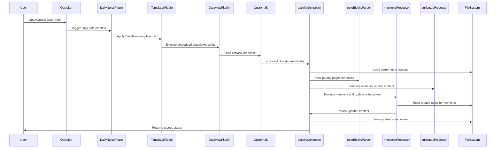
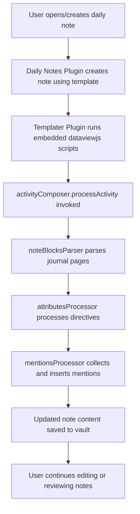
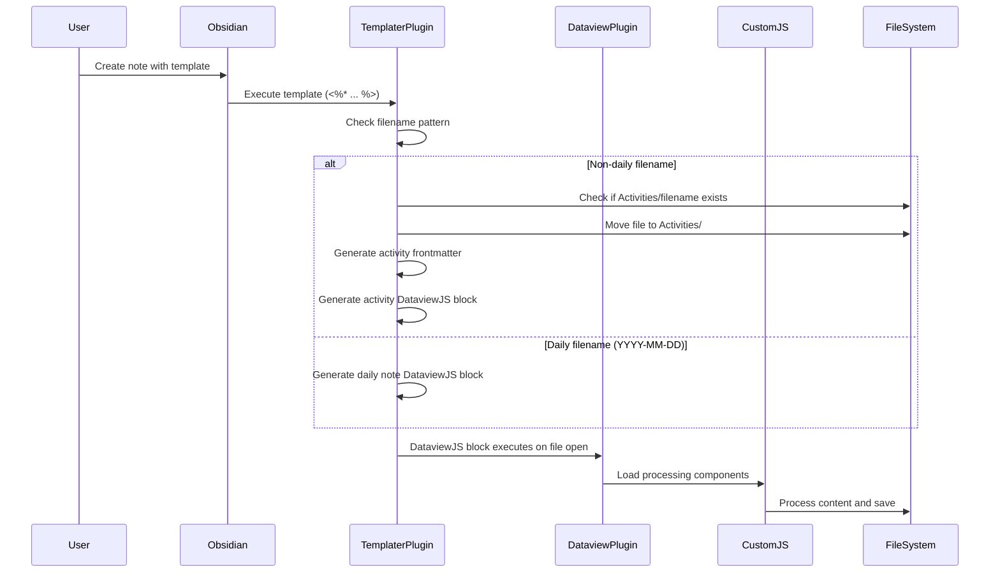

# Developer Workflow and Architecture for Knowledge Management System

This document provides a detailed technical overview of the knowledge management system architecture, workflows, and interactions for developers.

## Actors

- **User:** Creates and edits notes and daily journals in Obsidian.
- **Obsidian Plugins:**
  - **Daily Notes Plugin:** Automatically creates daily notes using templates.
  - **Dataview Plugin:** Provides querying and scripting capabilities.
  - **Templater Plugin:** Enables dynamic templates with embedded scripts.
  - **CustomJS Plugin:** Runs custom JavaScript modules.
- **Scripts:**
  - **activityComposer:** Main orchestrator for processing activity and daily notes.
  - **dailyNoteComposer:** Orchestrates daily journal note processing.
  - **mentionsProcessor:** Handles collection and insertion of mentions across notes.
  - **noteBlocksParser:** Parses note content into structured blocks.
  - **attributesProcessor:** Processes directives and updates frontmatter metadata.
  - **Other Components and Utilities:** Handle specialized processing and file operations.

## Workflow Sequence



## Flowchart Diagram



## Key Points

- The system leverages Obsidian's plugin ecosystem to automate note creation and processing.
- JavaScript orchestrators coordinate parsing, metadata processing, and mention handling.
- Mentions ([[...]] links) in notes dynamically link related content and trigger activity updates.
- Frontmatter metadata is updated to reflect note status, dates, and responsibilities.
- The architecture supports extensibility through modular components and utilities.

## Template System Architecture Evolution

### Hybrid Templater+DataviewJS Approach

The system has evolved from a pure DataviewJS approach to a hybrid Templater+DataviewJS architecture that provides superior file organization and processing capabilities.

#### Why Hybrid Approach Works Better

1. **File Movement Capabilities:** Templater can move and rename files during template instantiation, which is impossible with DataviewJS blocks that execute after file creation.

2. **Conditional Logic:** Templates can decide file destination based on filename format before any content is written, enabling smart file organization.

3. **Template Execution Timing:** Templater runs once during file creation vs DataviewJS that runs every time the file is opened, providing better performance for setup logic.

4. **Content Generation:** Can dynamically generate different template content based on conditions, creating truly adaptive templates.

#### File Organization Logic

**Smart File Routing Pattern:**
```javascript
// In DailyNote template
if (!moment(title, "YYYY-MM-DD", true).isValid()) {
  // Non-daily file → Move to Activities folder
  const newPath = `Activities/${title}`;
  const fileExists = await app.vault.adapter.exists(newPath + '.md');
  if (!fileExists) {
    await tp.file.move(newPath);
  }
  // Generate activity content
} else {
  // Daily file → Stay in Journal, process as daily note
}
```

**File Movement Implementation:**
- Uses `app.vault.adapter.exists()` for existence checking
- Prevents overwrites of existing files
- Proper path handling for subfolders
- Console logging for debugging

#### Content Generation Strategy

**Activity File Structure:**
```yaml
---
startDate: YYYY-MM-DD
stage: active
responsible: [Me]
---

```dataviewjs
// Complete processing pipeline
const {fileIO} = await cJS();
// ... full activity processing logic
```
```

**Processing Pipeline:**
1. **Template Execution** (Templater processes `<%* ... %>` blocks)
2. **File Movement** (Smart routing based on filename pattern)
3. **Content Generation** (Frontmatter + DataviewJS block creation)
4. **Dynamic Processing** (DataviewJS executes on file open)
5. **Content Assembly** (Final processed content with cross-references)

#### Template Design Principles

1. **Detailed Inline Logic:** User preference over centralized composer approach for better maintainability and transparency.

2. **Content Preservation:** Templates maintain any existing user content during processing.

3. **Error Handling:** Proper existence checking and console logging for debugging.

4. **Performance Optimization:** One-time Templater execution for setup, ongoing DataviewJS for dynamic content.

#### Architecture Benefits

- **Automatic Organization:** Files are automatically sorted into correct folders
- **Consistent Structure:** All activity files have the same processing pipeline
- **Dynamic Processing:** DataviewJS blocks regenerate content on each file open
- **Template Name Preservation:** No changes to template filenames (important for plugin configuration)
- **Hybrid Performance:** Best of both worlds - Templater for setup, DataviewJS for processing

### Updated Workflow Sequence



---

*Document created as part of project knowledge base.*
*Last updated: July 24, 2025 - Added template system architecture evolution*
