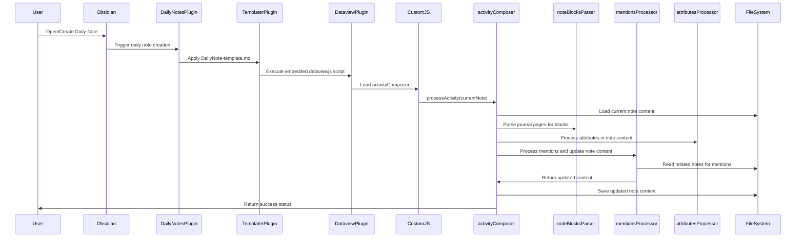
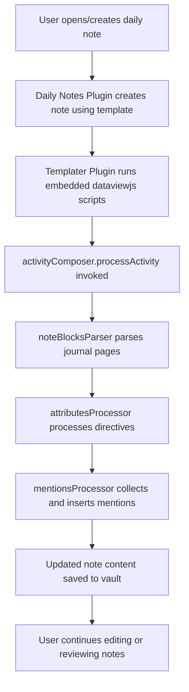

# Developer Workflow and Architecture for Knowledge Management System

This document provides a detailed technical overview of the knowledge management system architecture, workflows, and interactions for developers.

## Actors

- **User:** Creates and edits notes and daily journals in Obsidian.
- **Obsidian Plugins:**
  - **Daily Notes Plugin:** Automatically creates daily notes using templates.
  - **Dataview Plugin:** Provides querying and scripting capabilities.
  - **Templater Plugin:** Enables dynamic templates with embedded scripts.
  - **CustomJS Plugin:** Runs custom JavaScript modules.
- **Scripts:**
  - **activityComposer:** Main orchestrator for processing activity and daily notes.
  - **dailyNoteComposer:** Orchestrates daily journal note processing.
  - **mentionsProcessor:** Handles collection and insertion of mentions across notes.
  - **noteBlocksParser:** Parses note content into structured blocks.
  - **attributesProcessor:** Processes directives and updates frontmatter metadata.
  - **Other Components and Utilities:** Handle specialized processing and file operations.

## Workflow Sequence

## Flowchart Diagram

## Key Points

- The system leverages Obsidian's plugin ecosystem to automate note creation and processing.
- JavaScript orchestrators coordinate parsing, metadata processing, and mention handling.
- Mentions ([[...]] links) in notes dynamically link related content and trigger activity updates.
- Frontmatter metadata is updated to reflect note status, dates, and responsibilities.
- The architecture supports extensibility through modular components and utilities.

---

*Document created as part of project knowledge base.*
